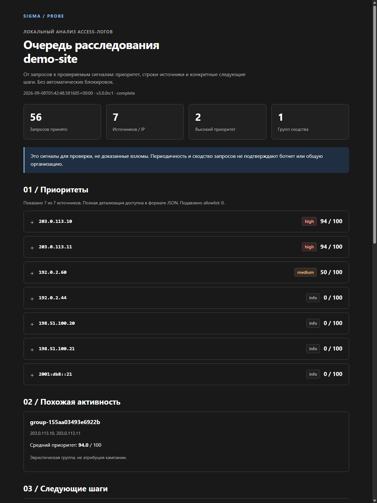
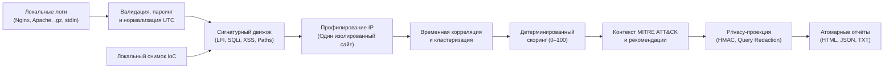

# 🔍 SIGMA-PROBE

[English](README.en.md) · Русский

[Совместимость форматов и ограничения](docs/COMPATIBILITY.md)

<p align="center">
  <strong>Офлайн-анализ access-логов для DevOps, SOC и веб-агентств.</strong><br>
  Превратите сырые Nginx/Apache логи в понятную очередь расследования, проверяемые строки-источники и отчёт для клиента.<br>
  <strong>Без сторонних зависимостей, без агентов, без баз данных и без отправки телеметрии в облако.</strong>
</p>

<p align="center">
  
  
  
  
  
  
</p>

---

## 📊 Интерактивный дашборд расследования

<p align="center">
  
</p>

> 💡 **Автономные отчёты:** каждый анализ атомарно генерирует три взаимосвязанных представления: интерактивный автономный HTML (без внешних CDN и JS-трекеров), строгий JSON и текстовую сводку `report.txt`.

Рядом с отчётами создаётся `manifest.json` с SHA-256 файлов. Для аутентифицированного манифеста задайте отдельный секрет `SIGMA_PROBE_REPORT_KEY` (не менее 32 байт UTF-8) при анализе и проверке. Проверка готового bundle: `PYTHONPATH=src python3 -m sigma_probe verify-report reports/<run-id>`. Без ключа хеши обнаруживают повреждение файлов, но не подтверждают происхождение отчёта.

После проверки отчёта можно сформировать **черновик** блокировки точного IP из `report.json`: `PYTHONPATH=src python3 -m sigma_probe propose-block reports/<run-id> --ip 203.0.113.10 --backend nginx --expires-at 2099-01-01T00:00:00Z --reason "Reviewed incident"`. Поддерживаются `nginx` и `iptables`; команда только печатает JSON с правилами и откатом, ничего не применяет и не снимает правила по истечении срока. При HMAC-псевдонимизации требуются исходные IP из защищённого локального источника: псевдоним нельзя превратить обратно в IP.

Для закоммиченных тестовых логов доступен [SARIF-экспорт](docs/CLI.md): `PYTHONPATH=src python3 -m sigma_probe export-sarif reports/<run-id> --source-root . --source input-1=examples/access.log > findings.sarif`. Экспорт проверяет хеш файла перед привязкой сигналов к строкам; production-логи не следует загружать в публичный репозиторий.

---

## 🎯 Зачем нужен SIGMA-PROBE

Когда на веб-сервере происходит подозрительный всплеск трафика или сканирование, инженеру приходится вручную разбирать гигабайты access-логов. Большинство инструментов либо требуют развёртывания тяжёлого SIEM-стека (Elastic/Splunk), либо отправляют клиентские логи в сторонние SaaS.

**SIGMA-PROBE создан для парадигмы «Один запуск — один сайт»:**

| Возможность | Как это устроено в SIGMA-PROBE |
| :--- | :--- |
| 🛡 **Zero-Dependency Architecture** | Работает исключительно на стандартной библиотеке Python 3.11+. Никаких рисков Supply Chain атак и несовместимости библиотек. |
| 🔎 **Детекция угроз LFI/RFI/SQLi/XSS** | Обнаруживает Path Traversal, чувствительные конфигурационные пути (`.env`, `.git`), шеллы, сканирующие User-Agent'ы и перебор авторизаций. |
| ⏱️ **Временной анализ (Temporal)** | Фиксация неестественной периодичности и низкодисперсионных интервалов запросов, характерных для сканеров и ботов. |
| 🧩 **Корреляция источников** | Объединение IP-адресов со схожим поведенческим профилем в группы подозрительной активности. |
| 🧾 **Evidence-First подход** | Каждая эвристика ссылается на конкретный входной файл, номер строки, UTC-время и HTTP-код ответа сервера. |
| 🔒 **Защита конфиденциальности** | Автоматическая маскировка параметров запроса (Query Redaction), HMAC-псевдонимизация IP и строгий HTML-экранинг. |

> [!NOTE]
> **Это инструмент расследования, а не WAF/SIEM.** Он выявляет подозрительные паттерны и помогает расставить приоритеты для человека, но не осуществляет автоматических сетевых блокировок.

---

## 🏗️ Архитектура конвейера



---

## ⚡ Быстрый старт за 60 секунд

Проект требует только **Python 3.11+** и запускается без предварительной установки сторонних пакетов.

### Linux / macOS

```bash
git clone https://github.com/etern1ty-crypto/SIGMA-PROBE.git
cd SIGMA-PROBE
PYTHONPATH=src python3 -m sigma_probe analyze --config config.example.toml
```

### Windows (PowerShell)

```powershell
git clone https://github.com/etern1ty-crypto/SIGMA-PROBE.git
cd SIGMA-PROBE
$env:PYTHONPATH="src"
python -m sigma_probe analyze -c config.example.toml
```

---

## 💻 Анализ в действии (Живые логи)

Запуск анализа тестового набора `examples/access.log` выполняет полный цикл парсинга, скоринга и генерации отчёта:

```powershell
python -m sigma_probe analyze -c config.example.toml
```

<details open>
<summary><b>Консольный вывод конвейера анализа</b></summary>

```json
INFO sigma_probe.main: Starting offline analysis
INFO sigma_probe.pipeline.ingestion: Read input-1: accepted=56 invalid=0 filtered=0
INFO sigma_probe.main: Analysis complete: events=56 actors=7 partial=False
{
  "exit_code": 0,
  "input_status": "complete",
  "reports": {
    "html": "reports/20260908T014248Z-1537b38e2c24/report.html",
    "json": "reports/20260908T014248Z-1537b38e2c24/report.json",
    "manifest": "reports/20260908T014248Z-1537b38e2c24/manifest.json",
    "text": "reports/20260908T014248Z-1537b38e2c24/report.txt"
  },
  "summary": {
    "accepted_events": 56,
    "actors": 7,
    "correlation_groups": 1,
    "filtered_events": 0,
    "high": 2,
    "info": 4,
    "invalid_lines": 0,
    "low": 0,
    "medium": 1,
    "suppressed": 0
  }
}
```
</details>

---

### Фрагмент детального расследования (`report.txt`)

Для каждого подозрительного источника формируется проверяемое доказательство:

```text
203.0.113.10  HIGH  94/100  suppressed=False
Теги: AUTOMATED_SCAN, CORRELATED_ACTIVITY, LFI_RFI, MULTIPLE_SIGNALS, SCANNER_UA, SENSITIVE_PATH

  RequestSignatures/LFI_RFI: Попытка обхода каталогов (Path Traversal):
    input-1:6  GET /download [404]
    input-1:9  GET /view [404]
    input-1:15 GET /download [404]

  RequestSignatures/SENSITIVE_PATH: Обращение к скрытым конфигурациям:
    input-1:12 GET /.env [404]
    input-1:23 GET /.env [404]
    input-1:34 GET /.env [404]

  TemporalDetector/AUTOMATED_SCAN: Низкая дисперсия интервалов обращений (автоматизированный сканер):
    input-1:6  GET /download [404]
    input-1:9  GET /view [404]
    input-1:12 GET /.env [404]

  GraphDetector/CORRELATED_ACTIVITY: Скоординированные действия с IP 203.0.113.11 в рамках временного окна.
```

---

## 🧪 Тестирование и верификация

Надежность алгоритмов парсинга, устойчивость к невалидным входным данным и отсутствие регрессий подтверждаются полным тестовым набором:

```powershell
$env:PYTHONPATH="src"
python -m unittest discover -s tests -p "test_*.py"
```

```text
........................................................................................................................
----------------------------------------------------------------------
Ran 138 tests

OK
```

- **138 тестов**: модульные, граничные случаи, LFI-сценарии, IoC-сопоставление, отчёты и упаковка.
- Поддержка Windows, macOS и Linux.
- Сборка в один исполняемый `.pyz`-архив или wheel без компилятора C.

---

## 📚 Справочник документации

| Документ | Описание |
| :--- | :--- |
| 📖 [Архитектура движка](docs/ARCHITECTURE.md) | Модель пайплайна, фазы анализа, изоляция профилей сайтов |
| 🔐 [Политика безопасности и конфиденциальности](SECURITY.md) | Защита от DoS, HMAC-маскирование IP, санитизация HTML |
| 🔍 [Аудит исходного кода](docs/AUDIT.md) | Ревизия 47 критических архитектурных и защитных узлов |
| 📜 [Спецификация схемы вывода](docs/REPORT_SCHEMA.md) | Контракт JSON-отчёта, поля доказательств, ATT&CK mapping |
| 🛠 [Настройка эвристик и правил](docs/CONFIGURATION.md) | Настройка весов скоринга и порогов |
| ✅ [Протокол валидации](docs/VALIDATION.md) | Матрица протестированных форматов Common/Combined/JSONL |
| 🧩 [Формат логов Angie/Nginx](examples/angie-nginx-log-format.conf) | Пример JSONL `log_format` для одного сайта |
| 🧪 [Локальный стенд Juice Shop](examples/lab/README.md) | Изолированный генератор тестового трафика и отчётов |
| 📝 [Changelog](CHANGELOG.md) | История изменений версии 3.0.0rc1 |

---

## 📜 Лицензия

Статус лицензии исходного проекта пока не подтверждён. См. [LICENSE](LICENSE) и [NOTICE](NOTICE) перед публичным распространением или коммерческим использованием.
