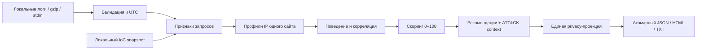

# SIGMA-PROBE

### Логи остаются у вас. Отчёт объясняет, что проверить первым.

Офлайн-анализ Nginx/Apache access-логов для DevOps-команд, MSP и веб-агентств. Превратите выгрузку логов в приоритеты расследования, проверяемые строки-источники и отчёт для клиента — без агента, базы данных и отправки телеметрии в облако.

[](docs/VALIDATION.md)
[](pyproject.toml)
[](requirements.txt)
[](CHANGELOG.md)
[](LICENSE)

> **Release candidate, не сертифицированная система защиты.** Программа выявляет признаки в запросах, а не доказывает взлом. В исходном архиве MIT заявлена без файла лицензии: перед публичной или коммерческой дистрибуцией нужно подтвердить права. Бейдж сборки относится к локальному протоколу; GitHub Actions и Docker в этой среде не запускались.

## Для чего

- Быстро разобрать access.log после подозрительного всплеска.
- Подготовить клиенту понятный отчёт со ссылками на конкретные строки, а не список «плохих IP» без объяснений.
- Периодически проверять отдельные сайты из контролируемых batch-выгрузок.

**Один запуск — один сайт.** Это не WAF, не SIEM, не real-time сервис и не движок Sigma rules. Никаких автоматических блокировок, активного сканирования или обещаний обнаружить все атаки.

## Главное

- 🔎 **Объяснимые сигналы:** traversal/LFI, SQLi, XSS, command-injection patterns, служебные пути, enumeration и серии HTTP-ошибок авторизации.
- 🧩 **Осторожная корреляция:** общие подозрительные пути, реальные близкие по времени события и ограниченные группы; не «подтверждённые ботнеты».
- 🧾 **Evidence-first:** входной файл, номер строки, UTC-время, HTTP-статус, слагаемые скоринга, SHA-256 входа и конфигурации.
- 🔐 **Локальная обработка:** query скрывается по умолчанию, IP можно псевдонимизировать через HMAC; HTML экранируется и не загружает внешние ресурсы.
- ⚙️ **Предсказуемая эксплуатация:** строгий TOML, IPv4/IPv6, `.gz`, JSONL, stdin, бюджеты ресурсов, коды возврата и атомарная публикация отчётов.
- 📦 **Ноль внешних Python-зависимостей:** wheel и переносимый `.pyz` собираются стандартной библиотекой.

## Архитектура



## Старт за 60 секунд

Требуется **Python 3.11+** с `venv`/`pip`, команды ниже — для Linux/macOS shell. Выполните из корня распакованного репозитория:

```bash
python3 -m venv .venv
.venv/bin/python -m pip install --no-index .
.venv/bin/sigma-probe analyze --config config.example.toml
```

Пример конфигурации читает **синтетический** `examples/access.log`. На стандартном примере: 56 событий, 7 IP, 2 источника высокого приоритета, 1 группа сходства. Это regression fixture, не оценка качества на реальном трафике.

CLI печатает JSON со сводкой и путями к `report.json`, `report.html`, `report.txt`. Откройте HTML локально в браузере. Каждый запуск создаёт отдельную папку в `reports/` и не перезаписывает прошлый отчёт.

**Без установки и без pip:**

```bash
python3 scripts/build_dist.py
python3 dist/sigma-probe.pyz analyze --config config.example.toml
```

В поставляемом архиве `.pyz` уже собран. [Пример HTML](examples/report.html) и [его JSON](examples/report.json) находятся в `examples/`.

## Практические примеры

```bash
# Свои логи: один сайт, несколько непересекающихся файлов
.venv/bin/sigma-probe analyze -i access.log -i access.log.1.gz -o reports/client-a --site client-a

# Только выбранный интервал: since включительно, until исключительно
.venv/bin/sigma-probe analyze -i access.jsonl --input-format jsonl \
  --since 2026-09-08T00:00:00Z --until 2026-09-09T00:00:00Z --format json

# Отчёт с псевдонимами IP; код 3, если найден high, после записи отчётов
.venv/bin/sigma-probe analyze -i access.log --anonymize-ips --fail-on high
```

Порог `high` по умолчанию — 70/100. **Баллы не являются вероятностью компрометации.** Неполный вход имеет отдельный код 4; ошибки конфигурации/ресурсных бюджетов — 2. [Все флаги и exit codes →](docs/CLI.md)

## 📚 Документация

- 📖 [Архитектура и внутреннее устройство](docs/ARCHITECTURE.md)
- ⚙️ [Настройка и конфигурация](docs/CONFIGURATION.md)
- 🚀 [Развёртывание и Production](docs/PRODUCTION.md)
- 🛠 [API / CLI справочник](docs/CLI.md)
- 🧪 [Проверки и границы готовности](docs/VALIDATION.md)
- 🔍 [Аудит исходника: файлы, строки, исправления](docs/AUDIT.md)
- 🎯 [Выбор ниши и продуктовая стратегия](docs/PRODUCT.md)
- 🔄 [Миграция с Helios 2.x](docs/MIGRATION.md)
- 🛡 [Модель угроз и ограничения детекции](docs/THREAT_MODEL.md)
- 🧾 [Формат JSON-отчёта](docs/REPORT_SCHEMA.md)

## Разработка

```bash
PYTHONPATH=src python3 -m unittest discover -s tests -t . -v
python3 scripts/check_repo.py
python3 scripts/build_dist.py
```

Тесты не требуют pytest или доступа в сеть. [CONTRIBUTING.md](CONTRIBUTING.md) описывает правила изменений; [SECURITY.md](SECURITY.md) — работу с уязвимостями. CI-конфигурация находится в [.github/workflows/ci.yml](.github/workflows/ci.yml).

## Roadmap

- [ ] Подтвердить лицензию у правообладателя и снять юридический release gate.
- [ ] Провести пилоты на размеченных логах, измерить false positives и пользу для расследования.
- [ ] Добавить profile-specific наборы правил по подтверждённым запросам клиентов.
- [ ] Рассмотреть stateful/incremental ingestion и интеграции с issue trackers после пилотов.

Эти пункты — планы, а не скрытые заглушки в рабочем CLI. SaaS, multi-tenant control plane, ML/FFT, remote feeds и автоблокировки не входят в реализованный scope.

## Лицензия и происхождение

Основано на предоставленном архиве SIGMA-PROBE / Helios. Исходные авторские сведения сохранены в [NOTICE](NOTICE). Статус прав описан в [LICENSE](LICENSE): **неподтверждённая upstream-лицензия**, а не самовольно выданная MIT. Изменённая версия не заявляется официальным релизом исходного автора.
