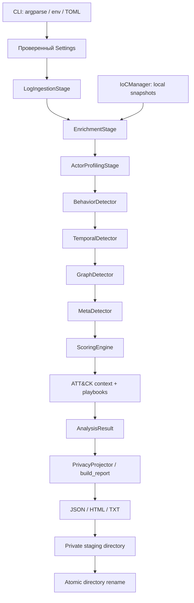

# Архитектура и внутреннее устройство

## Границы системы

SIGMA-PROBE 3.0.0rc1 — синхронное finite-batch приложение на Python 3.11+ со стандартной библиотекой. Runtime/build не зависят от сторонних Python-пакетов. Используются dataclasses, tomllib, ipaddress, statistics, hashlib/hmac, gzip, argparse и файловые API.

Нет демона, API-сервера, БД, multiprocessing, удалённых фидов или внешнего состояния. Один вызов `AnalysisPipeline.run()` создаёт новый контекст, счётчики, IoC manager и privacy projector. Повторные вызовы не наследуют теги или кампании предыдущего запуска.



## Модули

| Путь от корня | Ответственность |
|---|---|
| `src/sigma_probe/main.py` | CLI, сигналы, оркестрация, logging, exit codes |
| `src/sigma_probe/config.py` | TOML, precedence, строгие вложенные dataclasses |
| `src/sigma_probe/validation.py` | Общие проверки типов, чисел, IP, времени, ожидаемые ошибки |
| `src/sigma_probe/models/core.py` | LogEvent, ActorProfile, Evidence, ThreatCampaign, AnalysisResult |
| `src/sigma_probe/pipeline/ingestion.py` | Форматы входа, bounded reads, UTC, proxy trust, provenance |
| `src/sigma_probe/pipeline/enrichment.py` | Декодирование, path identity, фиксированные сигнатуры |
| `src/sigma_probe/pipeline/profiling.py` | Инкрементальные агрегаты и bounded evidence references |
| `src/sigma_probe/pipeline/detectors.py` | Серии ошибок, cadence, разреженная корреляция |
| `src/sigma_probe/pipeline/metadetector.py` | Нейтральный синтез нескольких signal families |
| `src/sigma_probe/pipeline/rules_engine.py` | Формула приоритета и пороги severity |
| `src/sigma_probe/pipeline/scoring.py` | Итоговый scoring после появления всех тегов |
| `src/sigma_probe/intelligence/` | IoC snapshots и минимальный ATT&CK mapping |
| `src/sigma_probe/pipeline/recommendations.py` | Конкретные рекомендации для ручного расследования |
| `src/sigma_probe/privacy.py` | Единая проекция идентификаторов и URL для всех форматов |
| `src/sigma_probe/pipeline/reporting.py` | Явный JSON contract, экранирование HTML, atomic publication |
| `src/sigma_probe/assets/report.css` | Локальные responsive/dark стили без CDN |
| `build_backend.py` | Узкий stdlib PEP 517 backend, METADATA/RECORD, wheel/sdist |

## 1. Ingestion и идентичность данных

Вход читается генератором, по одной ограниченной строке. Это **streaming чтение, но не unlimited-memory streaming аналитика**: валидные события сохраняются в bounded профилях до завершения batch.

- `.gz` распаковывается по мере чтения. Общий byte budget и SHA-256 относятся к **распакованным** байтам.
- SHA-256 включает исходные переводы строк и malformed/blank строки, если файл был дочитан.
- `input-N` — порядковый ID переданного источника; references указывают его и 1-based строку.
- Канонический IP поддерживает IPv4/IPv6, scoped IPv6 отвергается.
- Времена приводятся к aware UTC. Naive timestamp не угадывается по локальному timezone.
- Unix timestamps в JSON допускаются в секундах, не миллисекундах. ISO 8601 с offset предпочтительнее.
- Aliases JSON не могут противоречить друг другу; duplicate JSON keys — ошибка записи.
- `since` включительно, `until` исключительно. Для каждой строки выполняется баланс: blank + invalid + filtered + accepted = lines.
- Два явно различных JSON `host` в одном наборе — fatal error даже до time filter. Без `host` доказать site isolation из Combined невозможно: её обеспечивает оператор выгрузки.

Default JSON `source_ip`/`remote_addr` считается адресом сетевого peer. X-Forwarded-For учитывается только если peer попадает в явно настроенный CIDR. Цепочка обходится справа налево до первого недоверенного адреса. Нельзя доверять произвольному leftmost IP.

## 2. Признаки запросов

Сигнатуры фиксированы в коде, без пользовательских regex или eval. Для анализа используется raw URL и максимум две итерации percent-decoding; `+` превращается в пробел только в query. Path identity сохраняет регистр, `..` и ведущий двойной slash — свидетельства не нормализуются в безопасный путь.

`LFI_RFI`, `SQL_INJECTION`, `XSS`, `COMMAND_INJECTION`, `SENSITIVE_PATH`, `SCANNER_UA` — единый словарь для profiling/scoring/reporting. Энтропия вычисляется как вспомогательная метрика, но не повышает риск сама по себе. Обычные `.php`, curl, Googlebot, `/admin` или redirect на http:// сами по себе не дают attack tag.

Скрытие query выполняется **после анализа**. Иначе у request signatures пропадали бы существенные признаки. Raw URL остаётся в памяти API-результата: `result.actors` не предназначен для автоматического распространения.

## 3. Профили

`ActorProfile.add_event()` обновляет Counter и агрегаты за O(1) относительно числа уже накопленных событий. В конце события сортируются по UTC-времени, input ID и номеру строки. По каждому request-level тегу сохраняются ограниченные примеры, а полные количества — в метриках.

Allowlist не стирает исходные сигналы: `suppressed=true`, риск 0, actor остаётся в отчёте, исключается из поведенческой корреляции и рекомендаций. User-Agent не является доверенной идентичностью.

## 4. Детекторы

### BehaviorDetector

- Enumeration: достаточное число **различных error paths** и общая доля HTTP 4xx/5xx выше порога.
- Auth failures: пик HTTP 401/403 на точных настроенных login paths в закрытом sliding window.
- Error burst: пик всех 4xx/5xx в том же окне. Ошибка приложения является альтернативным объяснением.

Пиковое окно рассчитывается deque/two-pointer проходом после сортировки, без полного повторного копирования событий на каждом шаге.

### TemporalDetector

Коэффициент вариации `CV = population_std(intervals) / mean(intervals)`. Нужно достаточное число событий и положительное среднее. Низкий CV только записывает rhythmic metric; `AUTOMATED_SCAN` появляется лишь вместе с probing/enumeration/auth-failure контекстом. Все timestamp одинаковы — недостаточно данных для cadence вывода.

**FFT, autocorrelation и обучение моделей не используются.** Это сознательная честная семантика вместо неподтверждённых обещаний исходника.

### GraphDetector

1. Отобрать неподавленных акторов с request probes/IoC/enumeration.
2. Построить path-keyed sparse vectors только по подозрительным запросам и inverted index `path → actor IDs`.
3. Сформировать bounded candidate pairs, не полный граф всех обычных посетителей.
4. Требовать общую signal family, минимум общих path identities и фактические события на этих путях в пределах temporal window.
5. Проверить cosine similarity на **одних и тех же path coordinates**, не на рангах частот.
6. Построить детерминированную sorted first-fit clique partition. Каждый новый член должен быть связан со всеми членами группы. A~B и B~C не объединяют A,C без отдельного подтверждения сходства.
7. Применить лимит размера группы. Алгоритм не ищет глобально оптимальную клику и может разделить крупную похожую активность.

Бюджет evaluations учитывает candidate iterations, temporal comparisons, sparse-vector work и clique-membership comparisons. При превышении — явный отказ, не тихая выборка. `CORRELATED_ACTIVITY` означает сходство, не общее управление или C2.

### MetaDetector

Сопоставляет request payload, request behavior и local intelligence families. `MULTIPLE_SIGNALS` не прибавляет баллы и не повышает confidence других evidence. Несколько связанных эвристик не считаются статистически независимым доказательством.

## 5. Скоринг

```text
raw = сумма положительных настроенных весов уникальных тегов
      + min(repetition_bonus_cap, 3 × floor(log2(payload_request_count)))
score = min(100, raw)
```

Repetition применяется только при более чем одном payload request и ненулевом весе соответствующих payload-тегов. Один запрос с несколькими тегами считается одним запросом для repetition. При clamp в breakdown записывается отрицательный `cap_adjustment`, поэтому сумма всех вкладов точно равна score.

По умолчанию: info = 0, low = 1..39, medium = 40..69, high = 70..100. Нормальные посетители не увеличивают чужой риск через global multiplier. Campaign mean рассчитывается после окончательного скоринга акторов.

## 6. Вывод и завершение

Все три формата получают один `build_report` с едиными правилами privacy. JSON содержит все профили и собранные evidence records; это не копия всех raw events. HTML/text имеют явные display limits. Набор отчётов создаётся в частной staging-папке и публикуется одним rename; при исключении staging удаляется.

- Логи идут в stderr; stdout CLI — единственный JSON result.
- SIGINT/SIGTERM прерывают и блокирующий stdin read. Cleanup работает через context managers/finally; повторные сигналы временно игнорируются.
- После commit может остаться **полный** отчёт даже при сигнале перед stdout-acknowledgement. Отчётность не является транзакцией с вызывающим процессом.
- Внезапное выключение питания/SIGKILL/ошибки файловой системы не равнозначны graceful shutdown: см. production recovery.

## Сложность и эксплуатационные пределы

Основные стадии O(E) + сортировка событий O(E log E). Inverted-index correlation зависит от совпадений путей и дополнительно ограничивается бюджетами. Memory — O(E + A + candidate pairs + report projection), не O(1). Нет доказанного универсального RSS/throughput SLA. Настройки в [CONFIGURATION.md](CONFIGURATION.md), измерения конкретной среды — в [VALIDATION.md](VALIDATION.md).
